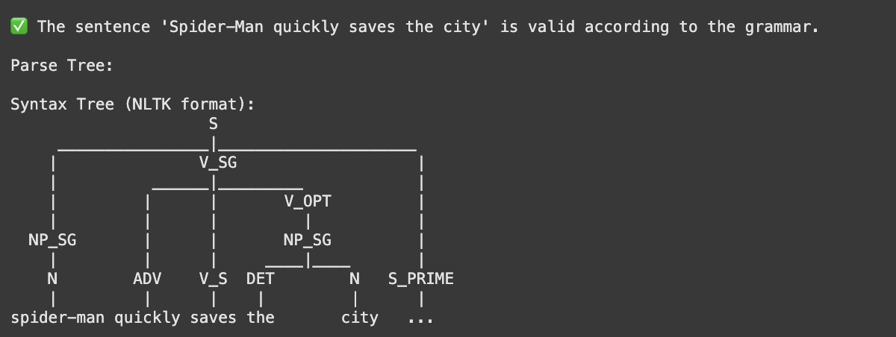

# Evidence: 2 Generating and Cleaning a Restricted Context-Free Grammar
Ian Hernández Hernández - A01276755

## Description
The language we're working with is a simplified subset of English, specifically focused on creating sentences about Marvel superheroes to make it more interesting. The grammar is designed to handle basic sentence structures with subjects, verbs, and objects, along with modifiers and conjunctions to form more complex statements.
### Language structure
Our grammar focuses on several key elements of English:

* Simple declarative sentences (Subject-Verb-Object structure)
* Noun phrases with optional determiners and adjectives
* Verb phrases with optional objects and modifiers
* Prepositional phrases as modifiers
* Compound sentences using conjunctions

Our grammar emphasizes syntactic structure and the relationship between different sentence components.
### Plural rules
To better understand we'll be using just this two rules for plural and singular in english:

* When the subject is singular, the verb is conjugated with an “s” at the end in the present tense. For example: Thor runs.

* When the subject is plural (composed of two or more subjects), the verb is used in its base form, without the “s”. For example: Thor and Loki run.

## Model
Before generating the grammar, here are the words that we'll be using:
### Nouns (NP)
#### Superheroes
* Iron Man
* Spider-Man
* Thor
* Hulk
* Black Widow
* Captain America
* Doctor Strange
* Black Panther

#### Villians:
* Thanos
* Loki
* Ultron
* Green Goblin

##### Objetcs:
* shield
* hammer
* suit
* web
* portal
* stone
* city
* universe

### Verbs (VP)
* fight
* save
* protect
* defeat
* fly
* shoot
* throw
* build
* create
* use

### Determinantes (DET)
* the
* a
* an
* this
* that

### Conectores (CONJ)
* and
* or
* but
* because

### Preposiciones (PP)
* in
* on
* with
* from
* to
* against

### Adverbios (ADV)
* quickly
* bravely
* secretly
* suddenly

### Adjetivos (ADJ)
* powerful
* amazing
* strong
* intelligent
* brave
* magical
* dangerous
* evil

## Grammar
Grammar is the set of rules that define the structure of a language, and parsing is the process of analyzing an input string to check if it conforms to these rules. In the context of programming languages, an LL(1) parser is a popular method for syntax analysis, where the “LL” refers to a left-to-right scan of the input with a single lookahead symbol. LL(1) parsers are particularly effective because they are simple to implement, require no backtracking, and construct the syntax tree in a top-down manner. This makes LL(1) parsers an optimal choice for testing whether a string adheres to a given grammar in a straightforward and efficient way.

### Initial grammar
```python
# Rule for a sentence
S -> NP_SG V_SG      
S -> NP_PL V_PL      
S -> S CONJ S        

# Rules for singular noun phrases
NP_SG -> DET N
NP_SG -> DET ADJ N
NP_SG -> N

# Rules for plural noun phrases (usando "and")
NP_PL -> NP_SG CONJ NP_SG   
NP_PL -> N_PL               

# Rules for verb phrases - singular 
V_SG -> V_S               
V_SG -> V_S NP
V_SG -> V_S PP
V_SG -> V_S NP PP
V_SG -> V_SG ADV          

# Rules for verb phrases - plural
V_PL -> V_P               
V_PL -> V_P NP
V_PL -> V_P PP
V_PL -> V_P NP PP
V_PL -> V_PL ADV          # 

# Rule for prepositional phrases
PP -> PREP NP_SG
PP -> PREP NP_PL
```
This initial grammar has two key issues:

1. Ambiguity: Rules like S -> S CONJ S allowed multiple interpretations for sentences with conjunctions.
2. Left Recursion: Rules such as S -> S CONJ S and V_SG -> V_SG ADV contained left recursion, making them incompatible with LL(1) parsers.

### Eliminate Ambiguity

Changes realized:
1. Replaced the ambiguous rule S -> S CONJ S with a new structure using S_PRIME
2. Combined several noun phrase rules into more compact forms
3. Restructured verb phrases using new non-terminals V_EXT and V_EXT_PRIME to handle different combinations of objects and modifiers
4. Simplified prepositional phrase rules

```python
# Rules for sentences
S -> NP_SG V_SG S_PRIME   
S -> NP_PL V_PL S_PRIME   
S_PRIME -> CONJ S | ε     

# Rules for singular noun phrases
NP_SG -> DET N | DET ADJ N | N

# Rules for plural noun phrases
NP_PL -> NP_SG CONJ NP_SG   

# Rules for verb phrases - singular
V_SG -> V_S V_EXT          
V_EXT -> NP V_EXT_PRIME    
V_EXT -> PP V_EXT_PRIME    
V_EXT -> ADV V_EXT_PRIME   
V_EXT -> ε                 
V_EXT_PRIME -> PP | ε      

# Rules for verb phrases - plural 
V_PL -> V_P V_EXT          

# Rule for prepositional phrases
PP -> PREP NP_SG | PREP NP_PL
```
These changes ensure that sentences with conjunctions now have only one possible parse tree, eliminating ambiguity.

### Eliminate Left Recursion
Left recursion occurs when a non-terminal symbol derives a string that begins with itself. In our original grammar, we had two instances of left recursion:

Left recursion creates significant problems for top-down parsers like LL(1) because:

1. Infinite Loops: When a parser attempts to expand a non-terminal with left recursion, it will repeatedly substitute the non-terminal with itself first, creating an infinite loop.
2. Stack Overflow: In implementation, this causes the parser's stack to grow indefinitely until it crashes.


``` python
# Rule for a sentence
S -> NP_SG V_SG S_PRIME   
S -> NP_PL V_PL S_PRIME   
S_PRIME -> CONJ S | ε     

# Rules for singular noun phrases
NP_SG -> DET N | DET ADJ N | N

# Rules for plural noun phrases
NP_PL -> NP_SG CONJ NP_SG   

# Rules for verb phrases 
V_SG -> V_S V_OPT | ADV V_S V_OPT         
V_OPT -> NP_SG PP | NP_SG | PP | ADV | ε

# Rules for verb phrases 
V_PL -> V_P V_OPT | ADV V_P V_OPT            

# Rule for prepositional phrases
PP -> PREP NP_SG | PREP NP_PL
```
Changes realized

1. Simplified the verb extension structure by replacing V_EXT and V_EXT_PRIME with a simpler V_OPT
2. Added support for adverbs before verbs (ADV V_S V_OPT)
3. Specified object types more precisely (NP_SG instead of generic NP)

The final grammar is now free from ambiguity and left recursion, making it suitable for LL(1) parsing while maintaining the ability to process complex sentences with multiple phrases and conjunctions.
## Grammar that recognizes the language

```python
 # Syntactic rules
    S -> NP_SG V_SG S_PRIME   
    S -> NP_PL V_PL S_PRIME   
    S_PRIME -> CONJ S | 

    # Rules for singular noun phrases
    NP_SG -> DET N | DET ADJ N | N

    # Rules for plural noun phrases
    NP_PL -> NP_SG CONJ NP_SG   

    # Rules for verb phrases 
    V_SG -> V_S V_OPT | ADV V_S V_OPT        
    V_OPT -> NP_SG PP | NP_SG | PP | ADV | 

    # Rules for verb phrases 
    V_PL -> V_P V_OPT | ADV V_P V_OPT         

    # Rule for prepositional phrases
    PP -> PREP NP_SG | PREP NP_PL

    # Lexical categories
    # Superheroes and villains (N)
    N -> 'iron man' | 'spider-man' | 'thor' | 'hulk' | 'black widow' | 'captain america' | 'doctor strange' | 'black panther'
    N -> 'thanos' | 'loki' | 'ultron' | 'green goblin'

    # Objects (N)
    N -> 'shield' | 'hammer' | 'suit' | 'web' | 'portal' | 'stone' | 'city' | 'universe'

    # Singular Verbs (V_S) - verbs with 's'
    V_S -> 'fights' | 'saves' | 'protects' | 'defeats' | 'flies' | 'shoots' | 'throws' | 'builds' | 'creates' | 'uses'

    # Plural Verbs (V_P) - base form verbs
    V_P -> 'fight' | 'save' | 'protect' | 'defeat' | 'fly' | 'shoot' | 'throw' | 'build' | 'create' | 'use'

    # Determiners (DET)
    DET -> 'the' | 'a' | 'an' | 'this' | 'that'

    # Connectors (CONJ)
    CONJ -> 'and' | 'or' | 'but' | 'because'

    # Prepositions (PREP)
    PREP -> 'in' | 'on' | 'with' | 'from' | 'to' | 'against'

    # Adverbs (ADV)
    ADV -> 'quickly' | 'bravely' | 'secretly' | 'suddenly'

    # Adjectives (ADJ)
    ADJ -> 'powerful' | 'amazing' | 'strong' | 'intelligent' | 'brave' | 'magical' | 'dangerous' | 'evil'
```
## Implementation + Testing
Now that we have our gammar complete let's test it. We'll be using Natural Language Toolkit (NLTK) library and working with Google Collabs, so it'll be easier and faster to test the grammar. 
You can just click in here,and it'll take you to the grammar test:
https://colab.research.google.com/drive/1jt0X6AN-sp-hcW53P4pgKN7fI8Luc1pu?usp=sharing 

Another way to do it would be running the .py file in your computer: If that's the case, follow the next steps: install python (if you don't have it yet) from python.org, clone the repository, navigate to the directory that contains the .py file. Install NLTK by running "pip install nltk" or "brew install python-nltk" (if you're on mac), in your console. Then run the program using the command: python english_grammar.py.

### Correct sentences
Valid sentences in our grammar include:

* Thor fights. (simple subject-verb)
* Spider-Man saves the city. (subject-verb-object)
* The powerful Thor throws the hammer. (subject with adjective, verb, object)
* Iron Man defeats Thanos with a suit. (includes prepositional phrase)
* Thor fights and Hulk smashes. (compound sentence with conjunction)

### Incorrect sentences
* Fights Iron Man Thanos
* The Thor hammer throws
* Iron Man quickly
* The save universe
* Powerful the Thor
* Quickly Thor hammer throws

### Running the program
Once you run the programm there would be 2 options, either you can check the test cases by typing "1" or test the grammar by writing your own sentences typing "2"

### Correct sentences trees 
Here are some trees from the correct sentences above:




## Analysis
### Complexity 
The implementation of our superhero grammar parser has a time complexity of O(n) where n is the length of the input. The key complexity factors are:

1. The tokenization process that handles compound names like "iron man" and "spider-man" requires iterating through the sentence once, giving us O(n) complexity.
2. Parsing itself uses NLTK's ChartParser which implements the Earley algorithm. While this has a worst-case complexity of O(n³), our grammar is designed to be unambiguous and deterministic, making the average case closer to O(n).
3. The test cases run in O(m) time where m is the number of test sentences, as each sentence is processed independently.

There are no nested loops that would increase the complexity beyond linear time in the main processing path, making this implementation efficient for the given requirements.

### Type of Grammar
The superhero grammar falls within the Context-Free Grammar (CFG) category in the Chomsky Hierarchy, classifying it as a Type-2 grammar. This is evident from several characteristics:

* Each production rule has a single non-terminal symbol on the left-hand side (like S, NP_SG, V_SG)
* The right-hand sides contain various combinations of terminals and non-terminals
* The grammar cannot be reduced to a regular grammar (Type-3) because many rules have multiple non-terminals on the right side
* We've eliminated left recursion and ambiguity, making it suitable for LL(1) parsing

The grammar is powerful enough to generate complex structures like "Thor protects the universe and Iron Man defeats Thanos" while maintaining parsing efficiency.

### Other Methods
Several alternative approaches could have been used to implement this superhero language parser:

* ANTLR: A powerful parser generator tool that could generate a more optimized parser from our grammar. It offers better error handling but would require learning a new tool and syntax.
* PyParsing: A pure Python alternative that doesn't require a separate grammar definition file. It offers a more programmatic approach to defining grammars but might be less intuitive for linguistically-focused applications.
* Lark: Another Python parsing library that supports both Earley and LALR parsing algorithms, potentially offering better performance for ambiguous grammars.

I chose NLTK because it provides an excellent balance of linguistic features, Python integration, and educational value. The library is well-documented, uses familiar CFG notation, and includes visualization tools for parse trees. While other tools might offer performance advantages for larger-scale applications, NLTK is optimal for this project given its focus on natural language processing and straightforward implementation.

## References

CSE Guru. (2021, 16 febrero). Construction of LL(1) #Parsing Table | Syntax Analyzer | Lec 46 | #Compiler Design [Vídeo]. YouTube. https://www.youtube.com/watch?v=eThEZejP2b8

GeeksforGeeks. (2025, 6 febrero). Construction of LL(1) Parsing Table. GeeksforGeeks. https://www.geeksforgeeks.org/construction-of-ll1-parsing-table/

Lyons, John, Ivić, Pavle, Hamp, & P, E. (2025, 30 marzo). Linguistics | Definition, Examples, Science. Encyclopedia Britannica. https://www.britannica.com/science/linguistics/Chomskys-grammar 

Plural Nouns: Rules and Examples. (2025, 16 enero). Plural Nouns: Rules And Examples | Grammarly. https://www.grammarly.com/blog/parts-of-speech/plural-nouns/

